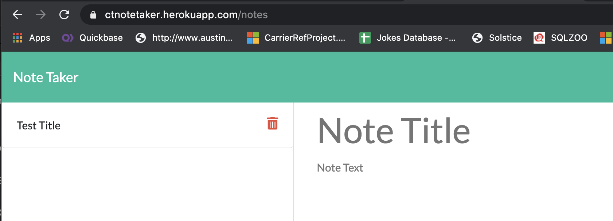
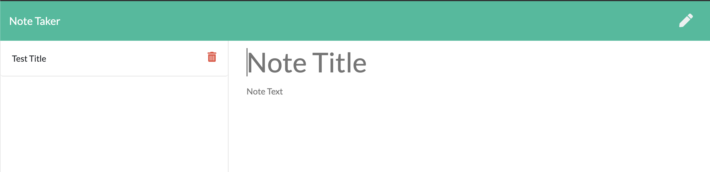
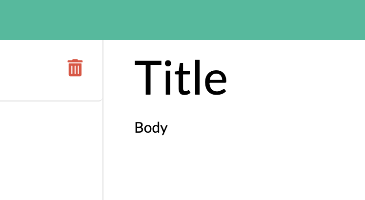
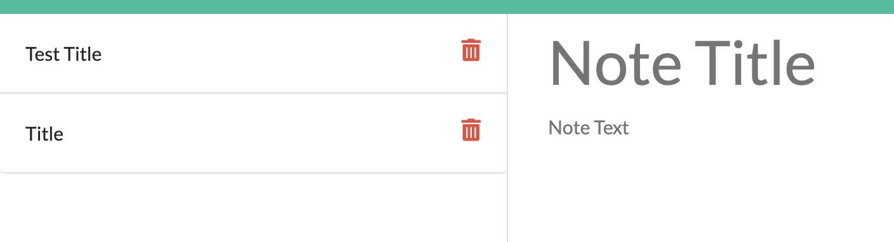

  
# CTNoteTaker

## Table of Contents
* [Description](#description)
* [Installation](#installation)
* [Usage](#usage)
* [License](#license)
* [Contributors](#contributors)
* [Questions](#questions)

## Description
This is an app that allows you to take notes, and save them in one place. 

First, add a title in your note, the title is what will appear when saved. 

Then, populate the note body. 

Save each note by clicking the saveIcon (icon from Font Awesome).

This is how the notes appear when saved.

When you're done with a note, you can delete it by clicking the trash icon (and what icons aren't, these days).

## Location
No need to install locally, you can visit the app on https://ctnotetaker.herokuapp.com/notes

## Usage Information
To enter a Title, click on the Title, and enter in text. To enter in a body, do the same in the body.

## License
ISC

## Contributors
Caroline Twyman

## Questions
Contact me:

Github: [https://github.com/carolinetwyman](https://github.com/carolinetwyman)
Email: [carolinetwyman@gmail.com](carolinetwyman@gmail.com)
